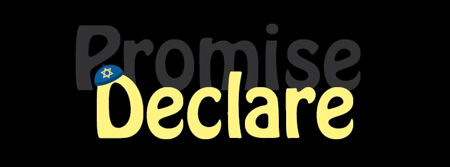

# Promise Challenge



## Story
- The client comes from a religious background and isn't comfortable with the word "promise" being part of their software
- The client wants a new class to replace the Promise, called... Declare
- you can clone [this boilerplate Repo](https://github.com/suvelocity/PromiseBoilerplate) or create a new one. 
- Edit or add index.js to implement the Declare class. 

## requirements from the Declare class
1. is not implemented using the built-in Promise Class.
1. can create an instance with an **executor** function using the **new** keyword
1. has a **then** method, which returns a **Declare** instance
1. can use the return value of the **executor** with __then__ method
1. can use multiple **then**s chained one after the other
1. can use an asynchronous **executor**

* **NOTE** - there's no need to handle errors in this implementation.

#### **HOT TIP** - add `.skip` to the end of a test to skip it in a run, and only test what you want to.
```javascript
test.skip("Is not an instance of Promise", () => {
    const declare = new Declare(()=>{});
    return expect(declare instanceof Promise).toBe(false);
  });
```

## Recommended prior knowledge

#### try to pass this challange using *only* the resources below:

- How Promise works?
[Promise MDN](https://developer.mozilla.org/en-US/docs/Web/JavaScript/Reference/Global_Objects/Promise)
[Promises - why!?   Callback-Hell VS Promises](https://medium.com/better-programming/callbacks-vs-promises-in-javascript-1f074e93a3b5)

- JS classes + constructor: 
[class guide](https://javascript.info/class)
[class MDN](https://developer.mozilla.org/en-US/docs/Web/JavaScript/Reference/Classes/constructor)

- JS, how does it reads your code?
[Asynchrony: Under the Hood](https://www.youtube.com/watch?v=SrNQS8J67zc&feature=youtu.be)

- bind is a method in js, which pssing a 'this' value, to another function.
it is necessary to use this method in the implementation.  
(learn more here)[https://developer.mozilla.org/en-US/docs/Web/JavaScript/Reference/Global_Objects/Function/bind]

## HINTS
[your stuck? click here!](TIPS.md)


